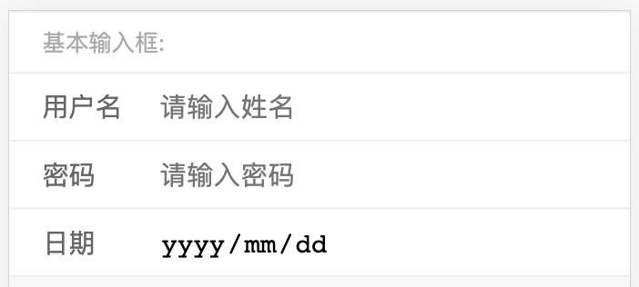
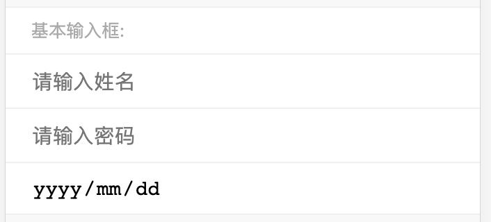
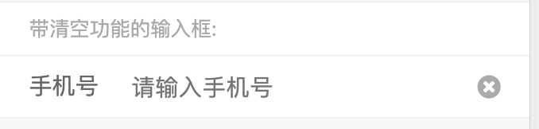
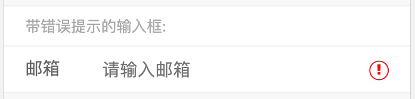

# 表单元素

### 基本输入框



#### 代码

```html
<div class="ido-content">
  <!-- 基本输入框 -->
  <h1 class="ido-panel-title">输入框:</h1>
  <div class="ido-panel-body no-padding">
    <div class="ido-form-item">
      <label class="ido-form-label">用户名</label>
      <div class="ido-form-body">
        <input class="ido-input" type="text" placeholder="请输入姓名" />
      </div>
    </div>
    <div class="ido-form-item">
      <label class="ido-form-label">密码</label>
      <div class="ido-form-body">
        <input class="ido-input" type="password" placeholder="请输入密码" />
      </div>
    </div>
    <div class="ido-form-item">
      <label class="ido-form-label">日期</label>
      <div class="ido-form-body">
        <input class="ido-input" type="date" placeholder="请选择日期" />
      </div>
    </div>
  </div>
</div>
```

#### 说明

- 使用了 no-padding 的 panel 面板来包裹基本输入框
- 在 input 外层包裹一个 div 是为了方便一行有多个输入框的情况
- 如果不需要，可以去掉 label 标签

### 去掉 label 标签的输入框



#### 代码

```html
<div class="ido-content">
  <!-- 基本输入框 -->
  <h1 class="ido-panel-title">输入框:</h1>
  <div class="ido-panel-body no-padding">
    <div class="ido-form-item">
      <!-- <label class="ido-form-label">用户名</label> -->
      <div class="ido-form-body">
        <input class="ido-input" type="text" placeholder="请输入姓名" />
      </div>
    </div>
    <div class="ido-form-item">
      <!-- <label class="ido-form-label">密码</label> -->
      <div class="ido-form-body">
        <input class="ido-input" type="password" placeholder="请输入密码" />
      </div>
    </div>
    <div class="ido-form-item">
      <!-- <label class="ido-form-label">日期</label> -->
      <div class="ido-form-body">
        <input class="ido-input" type="date" placeholder="请选择日期" />
      </div>
    </div>
  </div>
</div>
```

### 带清除功能的输入框



#### 代码

```html
<div class="ido-content">
  <!-- 带清空按钮的输入框 -->
  <h1 class="ido-panel-title">带清空功能的输入框:</h1>
  <div class="ido-panel-body no-padding">
    <div class="ido-form-item">
      <label class="ido-form-label">手机号</label>
      <div class="ido-form-body">
        <input class="ido-input" type="text" placeholder="请输入手机号" />
        <i class="fa fa-close ido-input-reset"></i>
      </div>
    </div>
  </div>
</div>
```

#### 说明

通过给 ido-form-body 加个图标标签，i 然后给 ido-input-reset 即可得到一个带清除功能的输入框

### 带错误提示的消息框



#### 代码

```html
<div class="ido-content">
  <!-- 带清空按钮的输入框 -->
  <h1 class="ido-panel-title">带清空功能的输入框:</h1>
  <div class="ido-panel-body no-padding">
    <div class="ido-form-item">
      <label class="ido-form-label">手机号</label>
      <div class="ido-form-body">
        <input class="ido-input" type="text" placeholder="请输入手机号" />
        <i class="fa fa-exclamation ido-input-warning"></i>
      </div>
    </div>
  </div>
</div>
```

#### 说明

跟 `带清除功能的输入框` 一样，加个 ido-input-warning 即可得到一个带错误提示的输入框

### 单选

在移动端，很少使用原生的 radio 或者 checkbox 样式，是因为这俩种输入方式的点击区域比较大，不太利于移动端的操作。


#### 代码

```html
<!-- 单选 -->
<div class="ido-content">
  <h1 class="ido-panel-title">单选:</h1>
  <div class="ido-panel-body no-padding">
    <div class="ido-form-item">
      <div class="ido-radio">
        <i class="fa fa-check ido-radio-icon"></i>
        <span class="ido-radio-desc">单选选项1</span>
        <input class="ido-radio-input" type="radio" />
      </div>
    </div>

    <div class="ido-form-item">
      <div class="ido-radio checked">
        <i class="fa fa-check ido-radio-icon"></i>
        <span class="ido-radio-desc">单选选项1</span>
        <input class="ido-radio-input" type="radio" />
      </div>
    </div>

    <div class="ido-form-item">
      <div class="ido-radio">
        <i class="fa fa-check ido-radio-icon"></i>
        <span class="ido-radio-desc">单选选项1</span>
        <input class="ido-radio-input" type="radio" />
      </div>
    </div>
  </div>
</div>
```

#### 说明

- 在此结构中，有一个 type 为 radio 的 input 框， 这里使用是为了记录单选的选择情况，用来给 js 使用，所以已经隐藏掉。

### 多选


#### 代码

```html
<div class="ido-content">
  <h1 class="ido-panel-title">多选:</h1>
  <div class="ido-panel-body no-padding">
    <div class="ido-form-item">
      <div class="ido-check">
        <i class="fa fa-check ido-check-icon"></i>
        <span class="ido-check-desc">多选选项1</span>
        <input class="ido-check-input" type="checkbox" />
      </div>
    </div>
    
    <div class="ido-form-item">
      <div class="ido-check checked">
        <i class="fa fa-check ido-check-icon"></i>
        <span class="ido-check-desc">多选选项2</span>
        <input class="ido-check-input" type="checkbox" />
      </div>
    </div>

    <div class="ido-form-item">
      <div class="ido-check checked">
        <i class="fa fa-check ido-check-icon"></i>
        <span class="ido-check-desc">多选选项3</span>
        <input class="ido-check-input" type="checkbox" />
      </div>
    </div>
  </div>
</div>
```
