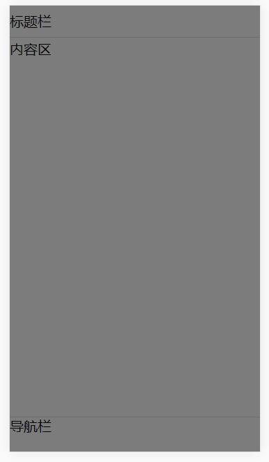
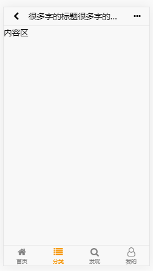

# 页面布局


#### 代码
```html
<div class="ido-header">
    标题栏
</div>
<div class="ido-navbar">
    导航栏
</div>
<div class="ido-content">
    内容区
</div>
<!-- 页面蒙版 -->
<div class="ido-mask"></div>
```
#### 说明
- 如果去掉header或者navbar，内容区会自动区填充
- 注意，ido-navbar 要放在ido-content 上面，这可能不符合我们正常的思维习惯，但是这样的设计是为了满足 `如果去掉header或者navbar，内容区会自动区填充` 这个特点的时候，直接使用css的兄弟选择器去控制，以减少js代码。

# 标题栏
   
#### 代码
```html
<div class="ido-header">
    <div class="left"><i class="fa fa-chevron-left"></i></div>
    <div class="title">标题</div>
    <div class="right"><i class="fa fa-ellipsis-h"></i></div>
</div> 
```
#### 说明
直接在 ido-header中添加 left、title、right即可完成常见页面的标题布局，里面的内容可以根据自己的情况灵活填充.
# 导航栏

#### 代码
```html
<!-- 底部导航栏 -->
<div class="ido-navbar">
    <a class="navbar-item">
        <i class="fa fa-home icon"></i>
        <span class="name">首页</span>
    </a>
    <a class="navbar-item active">
        <i class="fa fa-list icon"></i>
        <span class="name">分类</span>
    </a>
    <a class="navbar-item">
        <i class="fa fa-search icon"></i>
        <span class="name">发现</span>
    </a>
    <a class="navbar-item">
        <i class="fa fa-user-o icon"></i>
        <span class="name">我的</span>
    </a>
</div>
```
#### 说明
`ido-navbar` 下面可以放多个 navbar-item 建议2-5个
配置好对应的图标和文字即可


